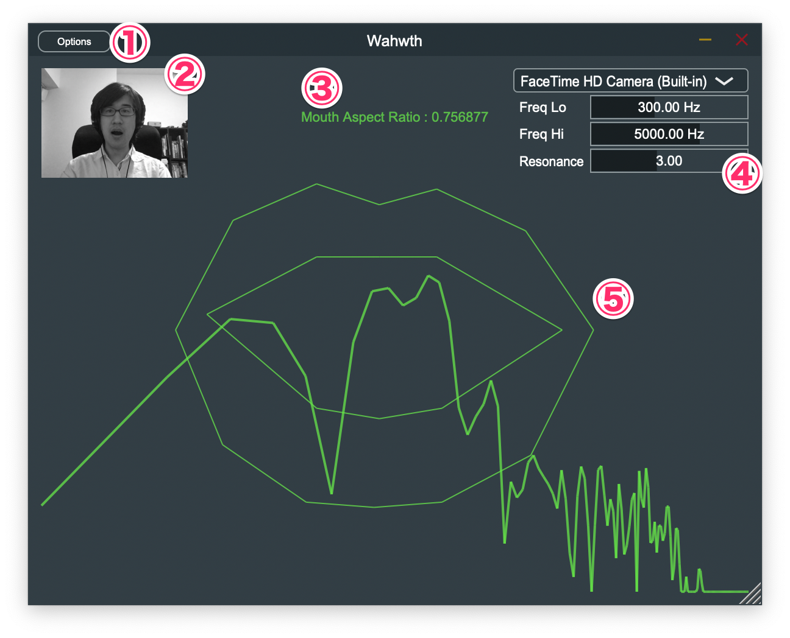

# Wahwth について

（最終更新 2020/06/06）

このアプリケーション／プラグインは、口で操作するワウエフェクタです。カメラから取得した画像を顔認識して、口の開き方でエフェクトのかかり方を調整できます。

## Win 版の内容物について

Zip ファイルを展開すると以下のファイルが作成されます。

```txt
wahwth-<バージョン番号>-win
├── Standalone
│   ├── Wahwth.exe         # スタンドアロンアプリケーション
│   └── Data               # データフォルダ
├── VST3
│   ├── Wahwth.vst3        # VST3 プラグイン
│   ├── Install-VST3.bat   # インストーラ
│   └── Uninstall-VST3.bat # アンインストーラ
└── README-ja.pdf          # このドキュメント
```

### Win 版インストール方法

* スタンドアロンアプリケーション版 Wahwth はインストールせずにそのまま実行できます。
  * スタンドアロンアプリケーション版 Wahwth を実行するには Data フォルダが必須です。もしスタンドアロンアプリケーション版 Wahwth を別の場所に移動した場合は、必ず Data フォルダも同じ場所に配置してください。
* VST3 プラグイン版 Wahwth をインストールするには、 `Install-VST3.bat` ファイルを右クリックして、「管理者として実行」コマンドを実行します。

### Win 版アンインストール方法

* VST3 プラグインをアンインストールするには、 `Uninstall-VST3.bat` ファイルを右クリックして、「管理者として実行」コマンドを実行します。

## Mac 版の内容物について

Zip ファイルを展開すると以下のファイルが作成されます。

```txt
wahwth-<バージョン番号>-mac/
├── AU
│   ├── Wahwth.component   # AudioUnit プラグイン
│   └── Components         # /Library/Audio/Plug-Ins/Components へのショートカット
├── Standalone
│   ├── Wahwth.app         # スタンドアロンアプリケーション
│   └── Applications       # /Applications へのショートカット
├── VST3
│   ├── Wahwth.vst3        # VST3 プラグイン
│   └── VST3               # /Library/Audio/Plug-Ins/VST3 へのショートカット
└── README-ja.pdf          # このドキュメント
```

### Mac 版インストール方法

* スタンドアロンアプリケーション版 Wahwth はインストールせずにそのまま実行できます。
  * Win 版と異なり、 Mac 版のスタンドアロンアプリケーションは同じディレクトリに Data フォルダを配置する必要はありません。
  * もしスタンドアロンアプリケーション版 Wahwth を「アプリケーション」ディレクトリにインストールしたい場合は、 Standalone ディレクトリ内に用意された Applications ショートカットへ「Wahwth」アプリケーションファイルをドラッグ・アンド・ドロップしてください。
* VST3 プラグイン版 Wahwth をインストールするには、 VST3 ディレクトリに含まれる `Wahwth.vst3` ファイルを、 同じディレクトリ内の VST3 ショートカットへドラッグ・アンド・ドロップしてください。
* AudioUnit プラグイン版 Wahwth をインストールするには、 AU ディレクトリに含まれる `Wahwth.component` ファイルを、 同じディレクトリ内の Components ディレクトリへドラッグ・アンド・ドロップしてください。

### Mac 版アンインストール方法

* 「アプリケーション」ディレクトリにインストールしたスタンドアロンアプリケーション版の Wahwth をアンインストールするには、「アプリケーション」ディレクトリを開き、その中の「Wahwth」アプリケーションファイルを削除してください。
* VST3 プラグイン版 Wahwth をアンインストールするには、 `/Library/Audio/Plug-Ins/VST3` ディレクトリから `Wahwth.vst3` ファイルを削除してください。
* AudioUnit プラグイン版 Wahwth をアンインストールするには、 `/Library/Audio/Plug-Ins/Components`ディレクトリから `Wahwth.component` ファイルを削除してください。

## 使用方法

スタンドアロン版の場合は、アプリケーションファイルをダブルクリックして、 Wahwth を起動できます。
左上の `[options]` ボタンを押すとオーディオデバイスを選択できるので、好みのオーディオデバイスを選択してください。

プラグイン版の場合は、プラグインをインストールしたあと、お使いの DAW 上に Wahwth をロードして使用してください。

## 画面について



* ① オーディオデバイス選択ダイアログを開きます。（スタンドアロン版のみ）
* ② カメラから入力した画像を表示します。右クリックで画像を左右反転できます。
* ③ 口の開き具合を表示します。
* ④ 使用するカメラやエフェクトの効き方を変更できます。
* ⑤ 検出した口の形状と、エフェクトを掛けた音の周波数成分を表示します。

④のエフェクトの効き方を調整するパラメータの効果は以下のとおりです。

|パラメータ名|効果|
|:---|:--------|
|Freq Lo|口の開き方に合わせて変化するフィルタの周波数の下限。この周波数が、口を閉じた状態でかかるバンドパスフィルタの中心周波数になります。|
|Freq Hi|口の開き方に合わせて変化するフィルタの周波数の上限。この周波数が、口を大きく開いた状態でかかるバンドパスフィルタの中心周波数になります。|
|Resonance|バンドパスフィルタの Q 値です。この値が大きいほどバンドパスフィルタの効き方が極端になります。|

## 動作上の補足事項

* DAW によっては Wahwth を正しくロードできないことがあります。（作者の手元の環境では、 Bitwig Studio 3 で Wahwth を起動できませんでした）
* この他なにか不具合を発見した場合は、下記連絡先に連絡をいただくか、[issues](https://github.com/hotwatermorning/wahwth/issues) へ報告をお願いします。

## ライセンスについて

Wahwth のソースコードは MIT ライセンスのもとで配布されます。
スタンドアロンアプリケーションとプラグインのそれぞれの実行ファイルは、 GPLv3 ライセンスのもとで配布されます。
実行ファイルに含まれる shape_predictor_68_face_landmarks.dat ファイルのライセンスは [`dlib-models`](https://github.com/davisking/dlib-models) を参照してください。

## 免責事項

@hotwatermorning は、このソフトウェアの使用によって生じたいかなる損害に対しても責任を負いません。
ご使用は自己責任でお願いします。

## 連絡先

* e-mail: hotwatermorning@gmail.com
* twitter: [`@hotwatermoring`](https://twitter.com/hotwatermorning)
